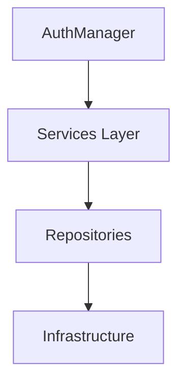
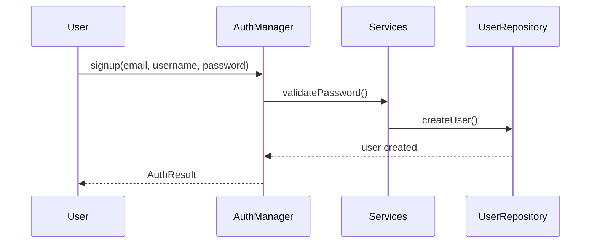
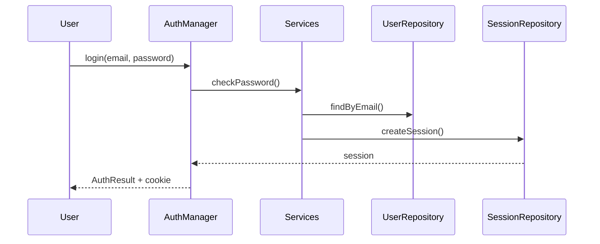
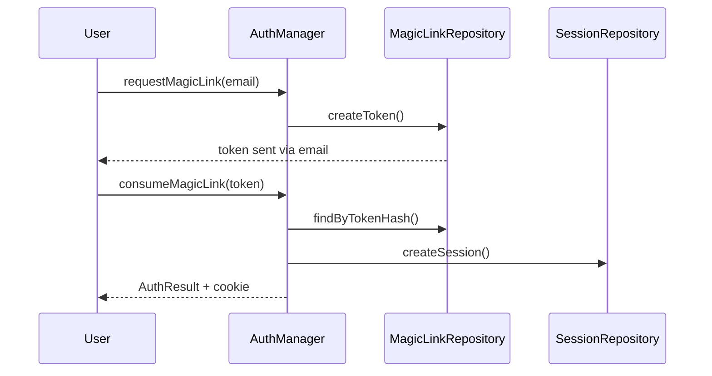

---

# 🛡️ MVP Auth

[](https://www.npmjs.com/package/@restingowlorg/mvp-auth)
[](LICENSE)

**MVP Auth** is a **framework-agnostic** and **database-agnostic** Node.js authentication library providing:

* Credentials authentication (`email + username + password`)
* Magic link (passwordless) authentication
* Session-based authentication

It exposes **business-level services** (`AuthManager`) and returns **structured results** (`AuthResult`) without leaking errors to consumers.

---

## Table of Contents

* [Features](#features)
* [Architecture](#architecture)
* [Installation](#installation)
* [Initialization](#initialization)

  * [PostgreSQL](#postgresql)
  * [MongoDB](#mongodb)
* [Core Types](#core-types)
* [Usage Examples](#usage-examples)

  * [Credentials Signup & Login](#credentials-signup--login)
  * [Magic Link Flow](#magic-link-flow)
* [Security Notes](#security-notes)
* [Extensibility](#extensibility)
* [Error Handling](#error-handling)
* [Database Schema Reference](#database-schema-reference-postgresql)
* [Best Practices](#best-practices)
* [Diagrams](#diagrams-flow)

---

## Features

* ✅ Credentials authentication (email + username + password)
* 🔗 Magic Link (passwordless) authentication
* 🍪 Session-based authentication
* 🧩 Framework agnostic (Express, NestJS, Fastify, custom)
* 🗄️ Database agnostic (PostgreSQL, MongoDB)
* 🧪 Strong typing with unified `AuthResult` and `IAuthManager`
* 🧱 Clean architecture: `AuthManager → Services → Repositories → Infra`
* 🔒 Secure password hashing & token handling
* 🔄 Automatic PostgreSQL schema validation & migrations
* 🛡️ Password strength & breach checks (OWASP-aligned)

---

## Architecture

MVP Auth follows a **layered, testable architecture**:



* **AuthManager:** Orchestrates authentication operations
* **Services Layer:** Handles validation, password hashing, token management
* **Repositories:** Implement database-agnostic CRUD contracts
* **Infrastructure:** Database adapters (PostgreSQL, MongoDB)

> Each layer is **independently testable**, ensuring maintainability and reliability.

---

## Installation

```bash
npm install @restingowlorg/mvp-auth
```

**Environment Variables:**

* PostgreSQL: `POSTGRES_URL`
* MongoDB: `MONGO_URI`

---

## Initialization

### PostgreSQL

```ts
import { AuthManager } from "flex-auth";

const auth = await AuthManager.init({
  dbType: "postgres",
  postgresUrl: process.env.POSTGRES_URL!,
  authTypes: ["credentials", "magic-link"],
  sessionTtlSeconds: 60 * 60 * 24 * 7, // 7 days
});
```

### MongoDB

```ts
const auth = await AuthManager.init({
  dbType: "mongo",
  mongoUri: process.env.MONGO_URI!,
  authTypes: ["credentials"],
});
```

**Notes:**

* PostgreSQL schemas are auto-validated/created if missing
* Custom table names supported via `userTableName`

---

## Core Types

### `IAuthManager`

```ts
export interface IAuthManager {
  signup(email: string, username: string, password: string): Promise<AuthResult>;
  login(email: string, password: string): Promise<AuthResult>;
  logout(sessionId: string): Promise<AuthResult>;
  me(sessionId: number): Promise<AuthResult>;
  requestMagicLink?(email: string): Promise<AuthResult>;
  consumeMagicLink?(token: string): Promise<AuthResult>;
}
```

### `AuthResult`

```ts
export interface AuthResult<T = any> {
  success: boolean;
  data: T | null;
  httpCode: number;
  message: string;
}
```

> All APIs return `AuthResult` — no errors leak to consumers.

---

## Usage Examples

### Credentials Signup & Login

```ts
// Signup
const result = await auth.signup("user@test.com", "username", "StrongPassword123!");
if (!result.success) return res.status(result.httpCode).json(result);
res.status(201).json(result);

// Login
const loginResult = await auth.login("user@test.com", "StrongPassword123!");
if (!loginResult.success) return res.status(loginResult.httpCode).json(loginResult);

res.cookie("AUTH_SESSION", loginResult.data.session.id, {
  httpOnly: true,
  sameSite: "lax",
});
```

### Magic Link Flow

```ts
// Request Magic Link
const magicResult = await auth.requestMagicLink!("user@test.com");
res.status(magicResult.httpCode).json(magicResult);

// Consume Magic Link
const consumeResult = await auth.consumeMagicLink!(token);
if (!consumeResult.success) return res.status(consumeResult.httpCode).json(consumeResult);

res.cookie("AUTH_SESSION", consumeResult.data.session.id);
res.json(consumeResult);
```

> ⚠️ Tokens are **never returned in production**.

---

## Security Notes

* Passwords hashed with `bcrypt`
* Magic link tokens are hashed & single-use
* Sessions validated server-side
* HTTP-only cookies recommended
* Password checks follow OWASP guidelines

---

## Extensibility

* Add new auth types by implementing services & repositories
* Custom database support by implementing repository contracts
* Use custom table names via `initPostgres` options
* Future logging and observability hooks supported

---

## Error Handling

* All methods return **`AuthResult`**
* No unhandled exceptions leak to consumers
* HTTP codes embedded: `200, 201, 401, 400, 500`

---

## Database Schema Reference (PostgreSQL)

| Table         | Columns                                 | Notes                                |
| ------------- | --------------------------------------- | ------------------------------------ |
| `users`       | id, email, username, password           | Library-managed or external table    |
| `sessions`    | id, user_id, expires_at, created_at     | References user PK                   |
| `magic_links` | id, user_id, token, created_at, used_at | Single-use passwordless login tokens |

> Schema is auto-created for library-managed tables.

---

## Best Practices

* Always use **HTTPS + Secure cookies**
* Keep **sessions short-lived**
* Validate external user tables before use
* Use **strong passwords** with optional breach checks

---

## Diagrams / Flow

### Signup / Login





### Magic Link Flow


